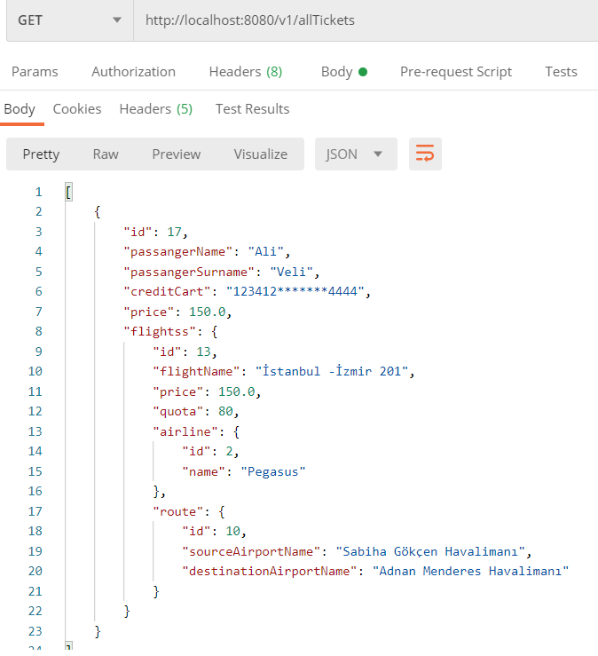

---

---

<h1 id="airline-api-project"><strong>Airline API Project</strong></h1>

<strong>Airline</strong>

<table>
<thead>
<tr>
<th>Request Url</th>
<th>HTTP</th>
<th>BODY</th>
<th>RESPONSE</th>
</tr>
</thead>
<tbody>
<tr>
<td>/v1/addAirline</td>
<td><code>POST</code></td>
<td>“name” : “Türk Hava Yolları”</td>
<td>OK</td>
</tr>
<tr>
<td>/v1/findByAirline/{name}</td>
<td><code>GET</code></td>
<td>-</td>
<td>{“id”:1, “name” : “Türk Hava Yolları”}</td>
</tr>
<tr>
<td>/v1/allAirlines</td>
<td><code>GET</code></td>
<td>-</td>
<td>[{“id”:1, “name” : “Türk Hava Yolları”},{“id”:2, “name” : “Pegasus”} ]</td>
</tr>
</tbody>
</table>
<strong>Airport</strong>

<table>
<thead>
<tr>
<th>Request Url</th>
<th>HTTP</th>
<th>BODY</th>
<th>RESPONSE</th>
</tr>
</thead>
<tbody>
<tr>
<td>/v1/addAirport</td>
<td><code>POST</code></td>
<td>{“name” : “Esenboğa Havalimanı”, “city”:“Ankara” }</td>
<td>OK</td>
</tr>
<tr>
<td>/v1/findByAirport/{name}</td>
<td><code>GET</code></td>
<td>-</td>
<td>{“id”:4, “name” : “Esenboğa Havalimanı”, “city”:“Ankara”}</td>
</tr>
<tr>
<td>/v1/allAirport</td>
<td><code>GET</code></td>
<td>-</td>
<td>[{“id”:4, “name” : “Esenboğa Havalimanı”, “city”:“Ankara”},{“id”:5, “name” : “İstanbul Havalimanı”, “city”:"İstanbul "}, {“id”:6, “name” : “Adnan Menderes Havalimanı”, “city”:“İzmir”} ]</td>
</tr>
</tbody>
</table>
<strong>Route</strong>

<table>
<thead>
<tr>
<th>Request Url</th>
<th>HTTP</th>
<th>BODY</th>
<th>RESPONSE</th>
</tr>
</thead>
<tbody>
<tr>
<td>/v1/addRoute</td>
<td><code>POST</code></td>
<td>{“sourceAirportName” : “Esenboğa Havalimanı”, “destinationAirportName”:“İstanbul Havalimanı” }</td>
<td>OK</td>
</tr>
<tr>
<td>/v1/findBySourceAirportName/{name}</td>
<td><code>GET</code></td>
<td>-</td>
<td>[{“id”:8, “sourceAirportName” : “Esenboğa Havalimanı”, “destinationAirportName”:“İstanbul Havalimanı”},          {“id”:9, “sourceAirportName” : “Esenboğa Havalimanı”, “destinationAirportName”:“Sabiha Gökçen Havalimanı”}]</td>
</tr>
<tr>
<td>/v1/allRoutes</td>
<td><code>GET</code></td>
<td>-</td>
<td>[{“id”:8, “sourceAirportName” : “Esenboğa Havalimanı”, “destinationAirportName”:“İstanbul Havalimanı”},{“id”:9, “sourceAirportName” : “Esenboğa Havalimanı”, “destinationAirportName”:“Sabiha Gökçen Havalimanı”} …]</td>
</tr>
</tbody>
</table>
<strong>Flight</strong>

<table>
<thead>
<tr>
<th>Request Url</th>
<th>HTTP</th>
<th>BODY</th>
<th>RESPONSE</th>
</tr>
</thead>
<tbody>
<tr>
<td>/v1/addFlight</td>
<td><code>POST</code></td>
<td>{“flightName” : "Ankara-İstanbul 101 ", “price”:100, “quota”:100, “airline”:{ “id”:3 }, “route”:{“id”:11} }</td>
<td>OK</td>
</tr>
<tr>
<td>/v1/findFlightByAirlineId/{id}</td>
<td><code>GET</code></td>
<td>-</td>
<td>{“id”:12, “flightName” : “Ankara-İstanbul 101”, “price”:100, “quota”:100, “airline”:{“id”:1, “name”: “Türk Hava Yolları”},“route”:{“id”:8,“sourceAirportName” : “Esenboğa Havalimanı”, “destinationAirportName”:“İstanbul Havalimanı”}}</td>
</tr>
<tr>
<td>/v1/allFlights</td>
<td><code>GET</code></td>
<td>-</td>
<td>{“id”:12, “flightName” : “Ankara-İstanbul 101”, “price”:100, “quota”:100, “airline”:{“id”:1, “name”: “Türk Hava Yolları”},“route”:{“id”:8,“sourceAirportName” : “Esenboğa Havalimanı”, “destinationAirportName”:“İstanbul Havalimanı”}} …</td>
</tr>
</tbody>
</table>
<strong>Ticket</strong>

<table>
<thead>
<tr>
<th>Request Url</th>
<th>HTTP</th>
<th>BODY</th>
<th>RESPONSE</th>
</tr>
</thead>
<tbody>
<tr>
<td>/v1/addTicket</td>
<td><code>POST</code></td>
<td>{“passangerName” : “Ali”, passangerSurname" : “Veli”, “creditCart”:“1234234122223333”, “fligtss”:{ “id”:14 } }</td>
<td>OK</td>
</tr>
<tr>
<td>/v1/findTicketById/{id}</td>
<td><code>GET</code></td>
<td>-</td>
<td>{“passangerName” : “Ali”, passangerSurname" : “Veli”,  “creditCart”:“123423*********3333”, “flightss”:{“id”:14, “flightName” : “Ankara-İstanbul 101”, “price”:175, “quota”:100,} “airline”:{“id”:1, “name”: “Türk Hava Yolları”},“route”:{“id”:8,“sourceAirportName” : “Esenboğa Havalimanı”, “destinationAirportName”:“İstanbul Havalimanı”}}</td>
</tr>
<tr>
<td>/v1/cancelTicket/{id}</td>
<td><code>DELETE</code></td>
<td>-</td>
<td>OK</td>
</tr>
</tbody>
</table>
 
 
 
 
 
 
 
 
 
 
 
 

